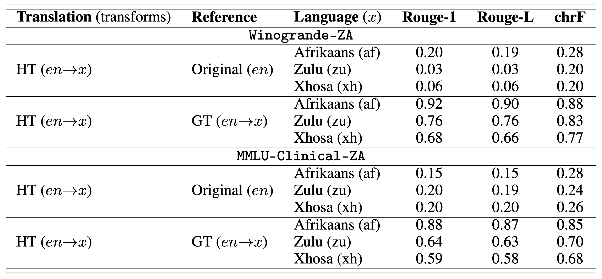
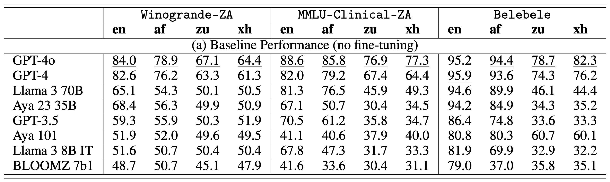
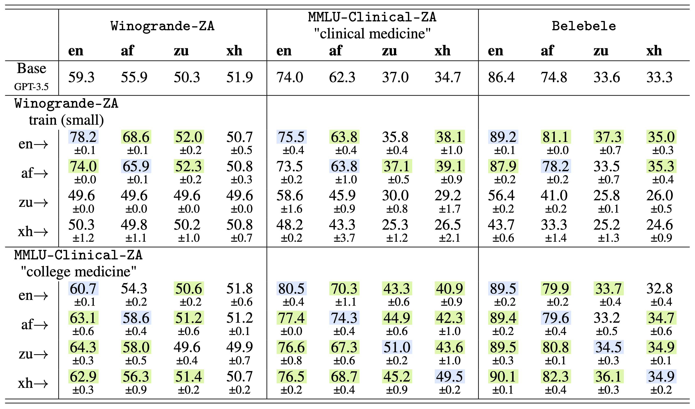

# Expanding Reasoning Benchmarks in Low-Resourced African Languages: Winogrande and Clinical MMLU in Afrikaans, Xhosa, and Zulu

**Authors:**
**Tuka Alhanai** <tuka@ghamut.com>, **Adam Kasumovic** <adam.kasumovic@ghamut.com>, **Mohammad Ghassemi** <ghassemi@ghamut.com>, **Guillaume Chabot-Couture** <Guillaume.Chabot-Couture@gatesfoundation.org>

This repository contains the benchmarks, translation results, and all code needed to recreate the results reported in our paper (URL Pending - paper under review).

<u>More specifically, This repository contains:</u>

1. **Winogrande-ZA Benchmark:** Translations of a popular multiple-choice reasoning benchmark, Winogrande, into three South African languages: Afrikaans, Zulu, and Xhosa,
2. **MMLU-Clinical-ZA Benchmark:** Translations of the clinical sections (college medicine and clinical knowledge) of MMLU into three South African languages: Afrikaans, Zulu, and Xhosa, and,
3. **Mono- and Cross-Lingual Benchmark Scripts:** Code used to regenerate the mono- and cross-lingual fine-tuning experiments presented in the paper. 

## Benchmark Download
The *MMLU-Clinical-ZA* and *Winogrande-ZA* benchmarks are provided in a [zip file](https://github.com/InstituteforDiseaseModeling/winogrande-mmlu-clinical-za/raw/main/winogrande-mmlu-clinical-za.zip) for download. 
The unzipped data can also be found in [`winogrande-mmlu-clinical-za/`](winogrande-mmlu-clinical-za/) (the release data folder).
```
winogrande-mmlu-clinical-za/
├── mmlu_clinical_za/          # Contains MMLU translated into Afrikaans, Zulu and Xhosa                 
├── winogrande_za/             # Contains the second version of Winogrande following a second round of Upwork translator corrections       
└── winogrande_za_old/         # Contains the original, first version of Winogrande translated by the first round of Upwork translators            
```
Note that the `data/` folder contains extra data used for running experiments. It is **not** the release data folder. `assets/` simply contains pictures for this README file, but all other folders in this repository have their own READMEs with some additional explanation (they are also mentioned further down in this README).

Our file naming conventions use [Hugging Face language codes](https://huggingface.co/languages) when referring to a language's identity (e.g. English --> en).

## Metadata

The Croissant metadata for the datasets in `winogrande-mmlu-clinical-za/` (the unzipped version of the release dataset file `winogrande-mmlu-clinical-za.zip`) may be found here (URL Pending).

[//]: # (Below is a mapping of language to language code used in the experiments and in file naming:)

[//]: # (```)

[//]: # ("English" -> "en" or ""  &#40;no suffix indicating original, English file&#41;)

[//]: # ("Afrikaans" -> "af")

[//]: # ("Zulu" -> "zu")

[//]: # ("Xhosa" -> "xh")

[//]: # (```)

## Installation
### 1. Clone the repository:
```shell
git clone https://github.com/InstituteforDiseaseModeling/winogrande-mmlu-clinical-za.git
cd winogrande-mmlu-clinical-za
```
### 2. Set up the Python environment (feel free to use your IDE to do this):
```shell
python3 -m venv venv
source venv/bin/activate
pip install --upgrade pip
pip install -r requirements.txt
```
### 3. Set up `config.json` file (gitignored by default) containing secrets:
```shell
cp config_example.json config.json
```
You will need to edit the newly created `config.json`, replacing the placeholders (`"your-key-here"`) as seen below:
```json
{
  "google_translate_api_key": "your-key-here",
  "huggingface_read_token": "your-key-here",
  "openai_key": "your-key-here",
  "openai_org": "your-org-here"
}
```
Naturally, you need to have valid Google Cloud, Hugging Face, and OpenAI accounts (with billing enabled for Google Cloud and OpenAI).  Assuming you have all of these, here are guides on how to locate each required key:

`google_translate_api_key`:
- [Setting up the translation API](https://cloud.google.com/translate/docs/setup)
- [Creating/finding your API key](https://cloud.google.com/docs/authentication/api-keys)

`huggingface_read_token`:
- [Creating/finding your Hugging Face token with **read** permissions](https://huggingface.co/docs/hub/security-tokens)

`openai_key`:
- [Creating/finding your API key](https://platform.openai.com/api-keys)

`openai_org`:
- [Locating your OpenAI organization name](https://platform.openai.com/settings/organization/general) (look at Organization *name* not Organization *ID*, and make the organization lowercase, replacing spaces with hyphens e.g. "Ghamut Corporation" becomes "ghamut-corporation")

### 4. Get access to gated Hugging Face models:
To use gated Hugging Face models out of the box, you must visit their model cards and agree to their terms. Make sure
you use the same account as the Hugging Face token you provided. Here are the links to the out of the box models we tested that you will need access to:
- [Llama 3 8B Instruct](https://huggingface.co/meta-llama/Meta-Llama-3-8B-Instruct)
- [Llama 3 70B Instruct](https://huggingface.co/meta-llama/Meta-Llama-3-70B-Instruct)
- [Aya 23 35B](https://huggingface.co/CohereForAI/aya-23-35B)

## Steps to Recreate the Results

Below we provide each of the tables presented in the paper followed by instructions on how to recreate the results presented therein.

### Table 1: **Results of Translation Quality Assessments**. 

For each of the three languages (Afrikaans, Zulu and Xhosa), the human translations HT (*en*→*x*) were compared (a) directly against the original English (Original (*en*)), (b) against a Google Translate output into the target language GT (*en*→*x*). Results reported in the table are the average Rouge-1, Rouge-L and chrF across all translated question-answer pairs. HT: Human Translation; GT: Google Translation.



To recreate the similarity results (measured with ROUGE-1, ROUGE-L, and chrF) between the original datasets, the human translations, Google Translate, and backtranslations (translating back to English with Google Translate), run the following:
```shell
chmod 755 run_translation_similarity_experiment.sh  # Give shell script execute permission
bash run_translation_similarity_experiment.sh
```

Results will be stored in [`results/translation_similarity`](results/translation_similarity).

Verbose, line-by-line results are titled `{dataset}_translation_similarity_{lang_code}.csv`

While average results are titled `{dataset}_translation_similarity_{lang_code}_averages.csv`

Where `{dataset}` is one of `mmlu` or `winogrande` and `{lang_code}` is one of `af` (Afrikaans), `zu` (Zulu), or `xh` (Xhosa).

### Table 2: **Results of State-of-the-Art Models on Translated Benchmarks** 

Top state-of-the-art models were evaluated on the translated Winogrande-ZA (binary-choice co-reference resolution task), the translated MMLU-Clinical-ZA (multiple-choice clinical knowledge reasoning task), as well a pre-existing benchmark Belebele (reading comprehension task). Results are provided for the three low-resource African languages of focus: Afrikaans (*af*), Zulu (*zu*), and Xhosa (*xh*). Results on English (*en*) are also provided as a reference. Best performance is indicated with an underline. GPT-4o out-of-the-box is the best performing model across all benchmarks, except for English on Belebele, where GPT-4 performs better.



To evaluate various Hugging Face (GPT model out-of-the-box performance is handled below) on *MMLU-Clinical-ZA* and *Winogrande-ZA*, navigate to [`experiments/out_of_the_box_performance`](experiments/out_of_the_box_performance).

There is a Jupyter Notebook for each Hugging Face model tested in our paper, that when run entirely (e.g. using "Run All") will evaluate the model. The notebooks contain the model they evaluate in the filenames (e.g. `Evaluate_Llama3_8B_Instruct.ipynb` evaluates [Llama 3 8B Instruct](https://huggingface.co/meta-llama/Meta-Llama-3-8B-Instruct)) . These models are evaluated on
*MMLU-Clinical-ZA*, *Winogrande-ZA*, and also *Belebele* in the same languages: English, Afrikaans, Zulu, and Xhosa.

For these experiments, we used [Azure Databricks](https://azure.microsoft.com/en-us/products/databricks) with a single *Standard_NC24ads_A100_v4* (NVIDIA A100 GPU) instance as the worker and driver type. We used the 
*14.3 LTS ML* Databricks runtime version. **As such, we recommend at least a single A100 GPU and at least 200 GB of disk space to store the model (or 400 GB in total for all models).**

Results will be stored in [`results/out_of_the_box_performance`](results/out_of_the_box_performance).

CSV files titled `{benchmark}_{model_name}.csv` will contain a matrix of results for the Hugging Face model on each language version of the benchmark, where `{benchmark}` is one of `mmlu`, `winogrande`, or `belebele`, 
and `{model_name}` is one of `Aya_23_35B`, `Aya_101`, `BLOOMZ_7b1`, `Llama3_8B_Instruct`, and `Llama3_70B_Instruct`. 

Verbose model output for each evaluation question will be stored in `generations_{model_name}.json`. Within this file, to identify the specific benchmark question, refer to the `custom_id` key. Here is the format for `custom_id`:

`{model_name}-on-{lang_code}-{benchmark}-{mmlu_section_if_mmlu}-{question_index}-answer-{correct_answer}`

where `{mmlu_section_if_mmlu}` is one of `clinical_knowledge` or `college_medicine`, `{question_index}` is a zero-based integer corresponding to the question number within the benchmark (e.g. 0 is the first question, 1 is the second question, etc.), and `{correct_answer}` is the correct answer for the question (e.g. `A`, `B`, `C`, or `D` for MMLU or Belebele, and `1` or `2` for Winogrande). 

For example,

`sample-model-on-zu-mmlu-college_medicine-0-answer-B`

indicates the row where `sample-model` answered the first question in the Zulu version of MMLU's college medicine test section, where the correct answer was `B`.

### Table 3: **Results of Cross-lingual Transfer**

GPT-3.5 was independently fine-tuned on the three African languages of focus: Afrikaans (*af*), Zulu (*zu*), and Xhosa (*xh*). GPT-3.5 was also fine-tuned on English (*en*) for reference. Two sets of date were used for fine-tuning, the first was fine-tuning with the translated *Winogrande-ZA* training set (small), while the second with the "college medicine" section of the translated *MMLU-Clinical-ZA*. The fine-tuned models were evaluated for their cross-lingual transfer performance on the translated *Winogrande-ZA* (binary-choice co-reference resolution task), the "clinical knowledge" section of the translated *MMLU-Clinical-ZA* (multiple-choice clinical knowledge reasoning task), as well a pre-existing benchmark Belebele (reading comprehension task). Columns indicate the target language of the evaluation, while the rows indicate the source language the models were fine-tuned with (e.g. "*zu*→" indicates model fine-tuned with data in Zulu). All numbers are performance accuracy (%). Model fine-tuning that yielded mono-lingual improvements (relative to the baseline) are in blue, while cross-lingual improvements (relative to the baseline) are in green.



First, `gpt-3.5-turbo-1106` must be fine-tuned on:

(i) The full MMLU College Medicine section in each of English, Afrikaans, Zulu, and Xhosa

(ii) Winogrande Train-S dataset in each of English, Afrikaans, Zulu, and Xhosa

After tuning all eight models, each model will be evaluated on the following:

(i) The MMLU clinical knowledge and college medicine test sections in each of English, Afrikaans, Zulu, and Xhosa. Note that MMLU-tuned models are not evaluated on the college medicine test section because it was included in their tuning data.

(ii) The Winogrande test set in each of English, Afrikaans, Zulu, and Xhosa

(iii) Belebele in each of English, Afrikaans, Zulu, and Xhosa

To run the entire fine-tuning and evaluation process, run the following:
```shell
chmod 755 run_gpt_35_cross_lingual_experiment.sh  # Give shell script execute permission
bash run_gpt_35_cross_lingual_experiment.sh 3  # Evaluate 3 times
```

**IMPORTANT: Do not run any other fine-tuning jobs or batches (or have them already running) on the organization you specified while this script is running. Create a separate organization/project if needed. This script will take around 24 hours to finish, depending on how OpenAI's APIs perform.**

Results will be stored in [`results/gpt_35_cross_lingual`](results/gpt_35_cross_lingual). Note that baseline performance (no fine-tuning)
of `gpt-3.5-turbo-1106` (most recent GPT-3.5 model available for fine-tuning), `gpt-4-turbo`, and `gpt-4o` will also be run and included in the results.

CSV files titled `{benchmark}_{timestamp}.csv` will contain a matrix of results for each model on each language version of the benchmark, where
`{timestamp}` is the time that the specific evaluation began processing (used to differentiate between evaluation runs of the same fine-tuned models).

Verbose model output for each evaluation question will be stored in `generations_{model_name}_{timestamp}.jsonl` (produced by OpenAI's batch API). Within this file, to identify the specific benchmark question, refer to the `custom_id` key. Here is the format for `custom_id`:

`{model_name}-on-{lang_code}-{benchmark}-{mmlu_section_if_mmlu}-{question_index}-answer-{correct_answer}`

For example,

`sample-model-on-zu-mmlu-college_medicine-0-answer-B`

indicates the row where `sample-model` answered the first question in the Zulu version of MMLU's college medicine test section, where the correct answer was `B`.

## Citation
```
@article{,
  title={Expanding Reasoning Benchmarks in Low-Resourced African Languages: Winogrande and Clinical MMLU in Afrikaans, Xhosa, and Zulu},
  author={Tuka Alhanai and Adam Kasumovic and Mohammad Ghassemi and Guillaume Chabot-Couture},
  year={2024}
}
```
